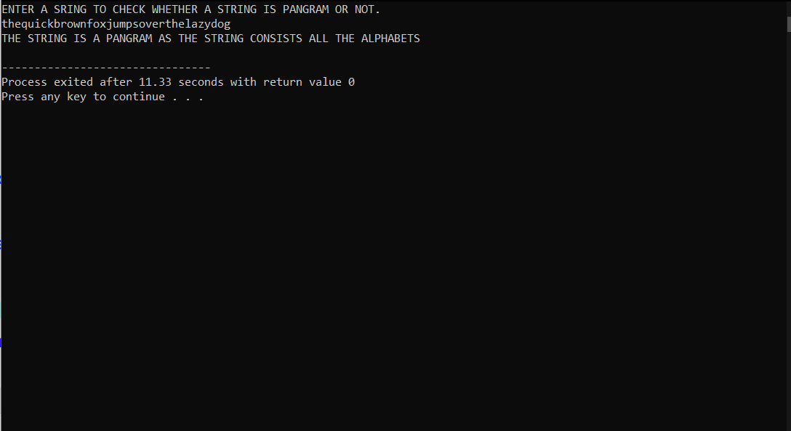

# Code
* A pangram is a sentence where every letter of the English alphabet appears at least once.

Given a string sentence containing only lowercase English letters, return true if sentence is a pangram, or false otherwise.

* The source code is  `string pangram.cpp`

* Output:-

